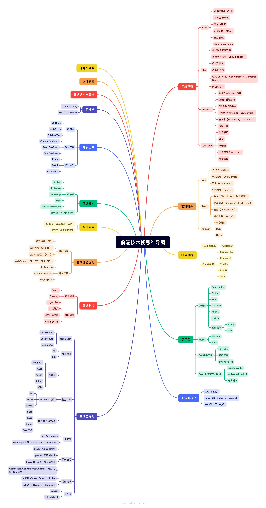

# 🧠 技术栈思维导图项目

[](https://github.com/yang-0930/tech-stacks-mindmap)
[](https://github.com/yang-0930/tech-stacks-mindmap)
[](LICENSE)

本项目收集和整理了各种技术栈的思维导图，帮助开发者系统性地学习和掌握相关技术。

## 🎯 思维导图效果展示

### 📱 前端技术栈思维导图



**🌐 在线交互式查看**: [点击这里查看HTML版本](./media/frontend-tech-stack.html)

> 💡 **提示**: HTML版本支持节点展开/折叠、缩放、拖拽等交互功能，提供更好的浏览体验！

### 🤖 Android技术栈思维导图

正在完善中... 敬请期待！

---

## 项目结构

```
├── README.md                    # 项目说明文档
├── mindmaps/                    # 思维导图文件
│   ├── frontend-tech-stack.md   # 前端技术栈思维导图（Markdown版）
│   └── android-tech-stack.md    # Android技术栈思维导图
├── details/                     # 技术细节文档
│   ├── css-details.md          # CSS技术细节
│   ├── javascript-details.md   # JavaScript技术细节
│   └── typescript-details.md   # TypeScript技术细节
└── media/                       # 媒体文件
    ├── frontend-mindmap.xmind   # 前端思维导图（XMind格式）
    ├── frontend-tech-stack.html # 前端技术栈思维导图（HTML可视化版）
    └── frontend-tech-stack-diagram.jpg  # 前端技术栈图表
```

## 📚 内容说明

### 思维导图 (mindmaps/)
- **前端技术栈**: 包含HTML、CSS、JavaScript、框架、工程化等完整前端技术体系
- **Android技术栈**: Android开发相关技术和工具

### 技术细节 (details/)
- **CSS细节**: CSS基础语法、布局、动画、现代特性等深入内容
- **JavaScript细节**: JS语法、ES6+特性、异步编程、DOM操作等
- **TypeScript细节**: 类型系统、泛型、装饰器等TS核心概念

### 媒体文件 (media/)
- XMind格式的思维导图文件
- 可视化图表和图片资源

## 🚀 使用建议

1. **学习路径**: 建议先查看 `mindmaps/` 目录了解整体技术栈结构
2. **深入学习**: 针对具体技术点，参考 `details/` 目录的详细文档
3. **可视化**: 使用 `media/` 目录中的XMind文件进行交互式学习

## 🤝 贡献

我们欢迎所有形式的贡献！无论是：

- 🐛 报告bug
- 💡 提出新功能建议
- 📝 改进文档
- 🔧 提交代码修复
- 🎨 优化思维导图设计

### 如何贡献

1. Fork 本仓库
2. 创建你的特性分支 (`git checkout -b feature/AmazingFeature`)
3. 提交你的修改 (`git commit -m 'Add some AmazingFeature'`)
4. 推送到分支 (`git push origin feature/AmazingFeature`)
5. 打开一个 Pull Request

## 📄 许可证

本项目采用 MIT 许可证 - 查看 [LICENSE](LICENSE) 文件了解详情。

## ⭐ Star History

如果这个项目对你有帮助，请给我们一个 ⭐️！

[](https://star-history.com/#yang-0930/tech-stacks-mindmap&Date)

---

<div align="center">
  <p>💖 感谢所有贡献者的支持！</p>
  <p>🌟 如果觉得有用，请点个 Star 支持一下！</p>
</div>

欢迎提交PR来完善和更新技术栈内容，让这个项目帮助更多开发者！